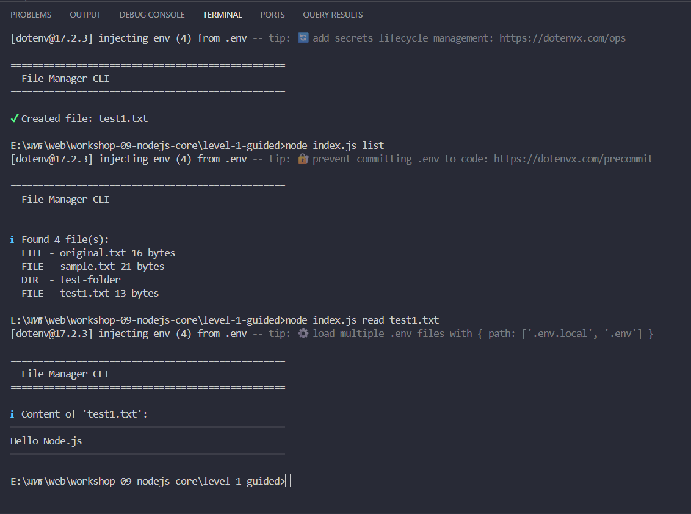
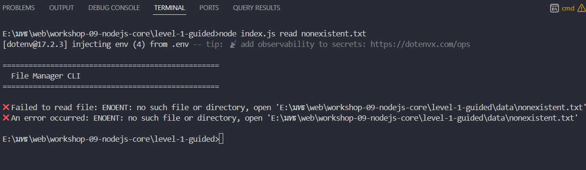

# EXPERIMENT_RESULTS 
# 📊 บันทึกผลการทดลอง - Workshop 9 Level 1

## ผู้ทดลอง
- ชื่อ: สรโชติ ใจสัตย์
- วันที่: 31/01/2026

## การทดลองที่ 1: ทดสอบคำสั่งพื้นฐาน

### คำสั่งที่ใช้:
node index.js create test1.txt "Hello Node.js"
node index.js list
node index.js read test1.txt

## ผลลัพธ์:

## การทดลองที่ 2: ทดสอบ Error Handling
node index.js read nonexistent.txt

## ผลลัพธ์:

## สังเกต:
กรณีไม่เจอไฟล์ จแสดง Error ว่า "no such file or directory"