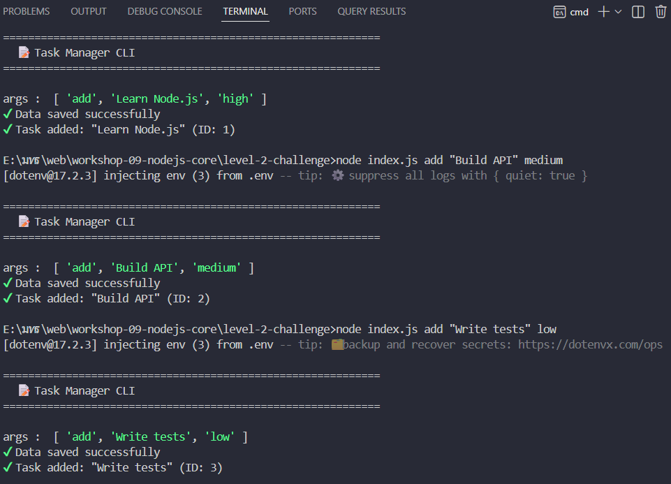
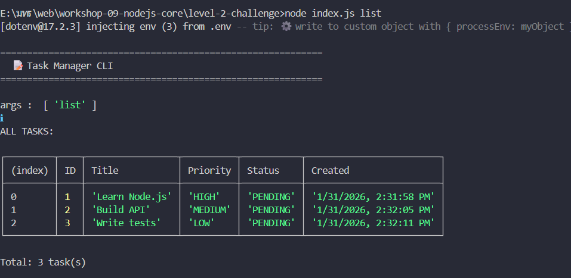
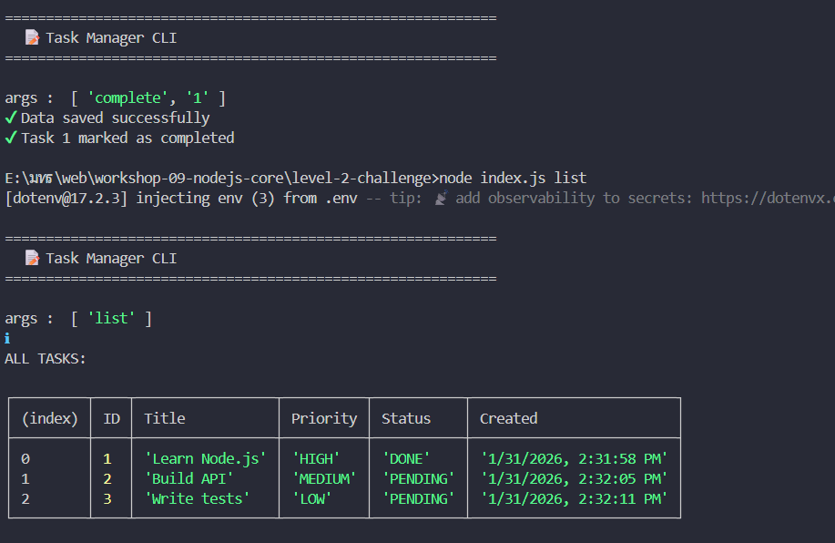
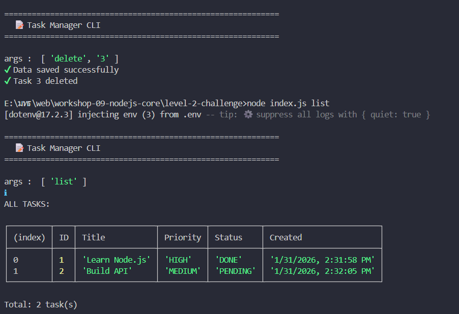
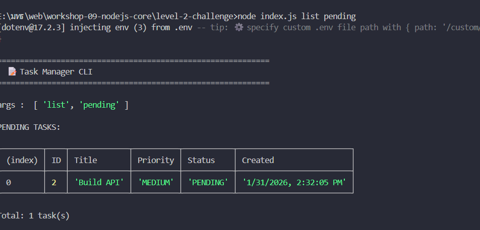
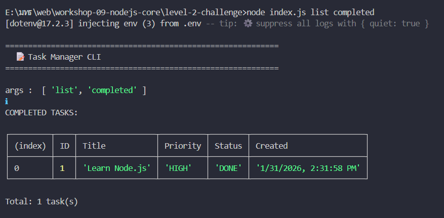
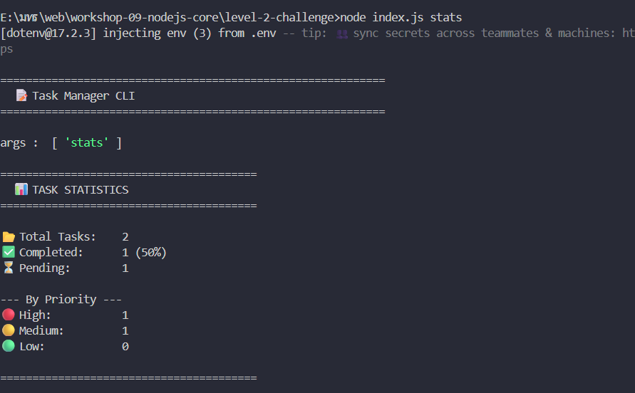
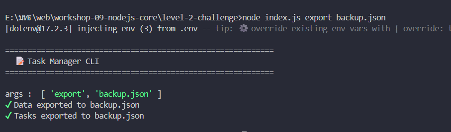

# 📊 บันทึกการพัฒนา Task Manager CLI

## ผู้พัฒนา
- ชื่อ: สรโชติ ใจสัตย์
- วันที่: 31/01/2026

## แนวทางการพัฒนา

### 1. storage.js
**ปัญหาที่พบ:**
- เรียกใช้ตัวแปรไม่ตรงกับที่ประกาศไว้

**วิธีแก้:**
- ไปดูว่าเราประกาศตัวแปรรว่าออะไร แล้วแก้ไขให้ตรงกัน

**สิ่งที่ได้เรียนรู้:**
- [บันทึกสิ่งที่เรียนรู้]

### 2. taskManager.js
**ปัญหาที่พบ:**
- ลืมประกาศ constructor จึงเกิด  error

**วิธีแก้:**
- ไปเพิ่ม consructor ก่อนเรียกใช้งาน class

## ผลการทดสอบ

### Test Case 1: CRUD Operations
- ✅/❌ เพิ่ม task
  
- ✅/❌ แสดง tasks
  
- ✅/❌ แก้ไข task
  
- ✅/❌ ลบ task
  

### Test Case 2: Advanced Features
- ✅/❌ กรอง tasks
  
- ✅/❌ Complete task
  
- ✅/❌ Statistics
  
- ✅/❌ Export/Import
  
  

## สรุป
 ได้เรียนรู้การทำ CRUD ในไฟล์ JSON 

